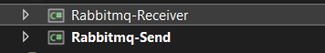

# RabbitMQ Kurulumu & Kullanımı

# RabbitMQ Docker Kurulumu

Kurulumu docker üzerinden yapacağımız için ilgili paketi docker hub üzerinden pull ediyoruz.

```jsx
docker run -d --hostname my-rabbit --name some-rabbit rabbitmq:3
```

Bu komutu kullanarak RabbitMQ ü docker olarak kurulumunu yapıyoruz. Burada default port 5672 dir. 

RabbitMQ bir management arayüzüne sahiptir. RabbitMQ ve yönetim rayüzünü tek pakette kurmak ilgili komutumuz

```powershell
docker run -d --hostname my-rabbit --name some-rabbit -e RABBITMQ_DEFAULT_USER=user -e RABBITMQ_DEFAULT_PASS=password rabbitmq:3-management
```

Burada ki `RABBITMQ_DEFAULT_USER` kullanıcı adı ve `RABBITMQ_DEFAULT_PASS` kullanıcı şifresidir. Eğer bir port tanımlaması yapılmak isteniyorsa `-p 8080:15672` komutu eklenmesi gerekir. Eğer bir kullanıcı adı ve şifre tanımlaması komut içerinde yapılmazsa kullanıcı adı ve şifre `guest` dir.

## Memory Limit

RabbimMQ memory yönetimini işlevselliğine sahiptir. Memory kullanımı belirli bir sınırı geçtiğinde geriye dönük işlevsellikler barındırır. Burada daha çok bilgiye ihtiyaç duyarsanız buradaki [belgeye](https://www.rabbitmq.com/memory.html) bakabilirsiniz.

## Management Plugin

```powershell
docker run -d --hostname my-rabbit --name some-rabbit rabbitmq:3-management
```

Eğer yönetim paneli ile kurmak istersek bu komutu kullanabiliriz. Eğer tarayıcıdan erişmek istersek [`http://container-ip:15672`](http://container-ip:15672/) bu bağlantıyı eğer ana pc dışında bağlanılmak isteniyorsa `8080` portunu kullanabiliriz.

Bunun için bu komutu kullanıyoruz. Burada 15672 portunu ana bilgisayarın 8080 portuna bağlıyoruz.

```powershell
docker run -d --hostname my-rabbit --name some-rabbit -p 8080:15672 rabbitmq:3-management
```

> ***Önemli olarak docker image ın run edildikten sonra bir süre beklendikten sonra RabbitMQ aktif hale gelecektir. Bunu log kayıtları üzerinden teyit edebiliriz***
> 

### RabbitMQ Docker Container Oluşturma (AMQP / Management)

Burada RabbitMQ container’ı oluştururken iki porta ihtiyacı vardır. Bunlardan birisi AMQP portu (5672) ikinci ise Management portu (15672).

```docker
docker run `
    --detach `
    --name rabbitmq-blog-management `
    --publish 5672:5672 `
    --publish 15672:15672 `
    rabbitmq:management
```

---

## RabbitMQ Temel Konular

RabbitMQ bir message broker’dır. Mesajları kabul eder ve yönlendirir. Bunu bir postahane olarak düşünebilirsiniz. Mesajınız göndermek için bir posta kutusuna koyduğunuzda bunu postahane ilgili alıcıya teslim edeceğinden emin olursunuz. RabbitMQ ü bir posta kutusu bir postahane ve bir mektup taşıyıcısı olarak düşünebilirsiniz.

RabbitMQ ile postahane arasındaki fark sadece bir kağıtla ilgilenmemesi bunun yerine binary blobs (ikili veri) data-messages (veri mesajları) ilgilenmesidir. RabbitMQ daha iyi anlaşılabilir olması için postahane jargonu sık kullanılmaktadır.

### .Net Console App İle Örnek Uygulama

Burada iki adet console app projesi kullanılacaktır. Pprojenin bir tanesi producer biri de consumer olarak kullanılacaktır. Burada producer ilgili mesajı consumer’a gönderirken ortadaki mesaj kuyruğunu (message queue) kullanır.


### Kurulum

İlk olarak 2 adet console app projesi oluşturalım. Bir projenin adını Send ve diğerinin adıda Receive olarak belirleyelim.



İlgili paketleri kurmak için aşağıdaki komutları kullanalım. Burada aynı paketi 2 proje içinde kurulumu yapalım.

```csharp
dotnet add package RabbitMQ.Client
```


Mesajı gönderecek olan (Rabbitmq-Send) projesinin kodlama aşamasına geçebiliriz.

## Rabbitmq-Send Projesinin Kodlanması

```csharp
using RabbitMQ.Client;
using System.Text;

var factory = new ConnectionFactory();
factory.HostName = "localhost";

using (var connection = factory.CreateConnection())

using (var channel = connection.CreateModel())
{
    channel.QueueDeclare(queue: "hello",
                                durable: false,
                                exclusive: false,
                                autoDelete: false,
                                arguments: null);

    string message = "Hello World!";
    var body = Encoding.UTF8.GetBytes(message);

    channel.BasicPublish(exchange: "",
                         routingKey: "hello",
                         basicProperties: null,
                         body: body);
    Console.WriteLine(" [x] Sent {0}", message);
}

Console.WriteLine(" Press [enter] to exit.");

Console.ReadLine();
```

Program.cs içerisinde yukarıda ki kodu kopyaladıktan sonra adım adım aşamaları açıklayalım.

```csharp
var factory = new ConnectionFactory();
factory.HostName = "localhost";
```

Burada ConnectionFactory sınıfında bir connection newledikten sonra `HostName` parametresine `[localhost](http://localhost)` değerini atamasını yapıyoruz ama `localhost` tanımlamasını yapmazsak default olarak `localhost` tanımlanacağı için bir sorun olmayacaktır lakin custom oluşturulmuş bir host için gerekli parametre tanımlamalarını yapmamız gerekir.

---

### Default Değerler

| Property | Default Value |
| --- | --- |
| Username | "guest" |
| Password | "guest" |
| Virtual host | "/" |
| Hostname | "localhost" |
| Port | 5672 for regular ("plain TCP") connections, 5671 for connections with TLS enabled |

```csharp
using (var connection = factory.CreateConnection())
```

Gerekli olan bağlantı parametrelerini tanımladıktan sonra `connection` oluşturuyoruz.

---

```csharp
using (var channel = connection.CreateModel())
{
    channel.QueueDeclare(queue: "hello",
                                durable: false,
                                exclusive: false,
                                autoDelete: false,
                                arguments: null);

    string message = "Hello World!";
    var body = Encoding.UTF8.GetBytes(message);

    channel.BasicPublish(exchange: "",
                         routingKey: "hello",
                         basicProperties: null,
                         body: body);
    Console.WriteLine(" [x] Sent {0}", message);
}
```

RabbitMQ bir Channel oluşturmak için `CreteModel()` metodu kullanılır. İlgili Channel oluşturulduktan artık Channel üzerinden mesaj alıp ve gönderebiliriz. Connection gibi Channel da long-lived (uzun ömürlü) olması gerekir. Her transaction için bir Channel açmak verimsiz ve kesinlikle önerilmez. Queue oluşturmak için bilmemiz gereken parametreler vardır. Bunlar;

> queue: Oluşturulacak olan kuyruğun adını belirtir.
> 

> durable: Default oluşturulan kuyruktaki mesajların hepsi bellekte tutulur. RabbitMQ sunucusu restart edilirse yada herhangi bir sebepten dolayı yeniden başlatılırsa kuyruktaki veriler kaybolabilir. durable parametresi true olarak ayarlanırsa veriler fiziksel hale gelerek veri kaybı önlenmiş olur.
> 

> exclusive:Oluşturulacak olan kuyruğa birden fazla Channel ın bağlanıp bağlanamayacağını ayarlar.
> 

> autoDelete: Tüm mesajlar bittikten sonra ilgili Channel ı yok eder.
> 

Bu aşamaya kadar kodlama aşamsını tamamladıktan sonra uygulamayı run ettiğimizde RabbitMQ yönetim panelinde Queues tabında ilgili gönderilmeyi bekleyen Channel a ait mesajların sayısını Ready kolonunda görüyoruz.


Burada ilgili mesajımız oluştuğuna göre burada ki bilgileri tüketmek için ilgili Receiver projemizi kodlamaya başlayabiliriz.

## Rabbitmq-Receiver Projesinin Kodlanması

```csharp
using RabbitMQ.Client;
using RabbitMQ.Client.Events;
using System.Text;

var factory = new ConnectionFactory() { HostName = "localhost" };

using (var connection = factory.CreateConnection())

using (var channel = connection.CreateModel())
{
    {
        channel.QueueDeclare(queue: "hello",
                             durable: false,
                             exclusive: false,
                             autoDelete: false,
                             arguments: null);

        var consumer = new EventingBasicConsumer(channel);
        consumer.Received += (model, ea) =>
        {
            var body = ea.Body.ToArray();
            var message = Encoding.UTF8.GetString(body);
            Console.WriteLine(" [x] Received {0}", message);
        };
        channel.BasicConsume(queue: "hello",
                             autoAck: true,
                             consumer: consumer);

        Console.WriteLine(" Press [enter] to exit.");
        Console.ReadLine();
    }

}
```

Program.cs içerisine kodlarımızı yazdıktan sonra adım adım aşamaları inceleyelim.

```csharp
var factory = new ConnectionFactory() { HostName = "localhost" };

using (var connection = factory.CreateConnection())
```

Burada Send projesinde `connection` oluşturma aşaması ile birebir aynı şekilde kodlamamızı yaptık. Connection başlattıktan sonra `CreateModel()` metodu ile bir Channel instance i oluşturuyoruz ve ilgili scope altında Send projesinden gönderilen mesajları tüketmek için `channel.QueueDeclare` metodu ile Send tarafında ki oluşturulan Channel tanımlamasını birebir olarak burada da yapıyoruz.

```csharp
channel.QueueDeclare(queue: "hello",
                             durable: false,
                             exclusive: false,
                             autoDelete: false,
                             arguments: null);
```

RabbitMQ sunucusunun mesajları bize iletmesi için gereken kodlamayı yapalım. Sunucundan gelen mesajı Asenkron şekilde tüketeceğimiz için callback tanımlaması yapıyoruz. Bu işlemi yürütücek olan `EventingBasicConsumer` event handlerını tanımlıyoruz.

```csharp
        var consumer = new EventingBasicConsumer(channel);
        consumer.Received += (model, ea) =>
        {
            var body = ea.Body.ToArray();
            var message = Encoding.UTF8.GetString(body);
            Console.WriteLine(" [x] Received {0}", message);
        };
        channel.BasicConsume(queue: "hello",
                             autoAck: true,
                             consumer: consumer);

```

Gerekli kodlamaları yaptıktan sonra Send projesi ile ilgili Channel a mesajlarımızı iletiyoruz.


Yukarıda ki Ready kolonunda 5 adet mesajımız Consumer tarafından tüketilmeye hazır durumda. Receiver projemizi run ettiğimizde ilgili mesajlarımızın alınarak tüketilmesini bekliyoruz.


Consumer projemizi run ettikten sonra 5 adet mesajımızın alınıp işlendiği görüyoruz bunu RabbitMQ management panelden doğrulayalım.


Görüldüğü üzere Ready kolonu 0 değerine sahip yani Consumer projemizin mesajları başarılı bir şekilde tükettiğini anlayabiliyoruz.
